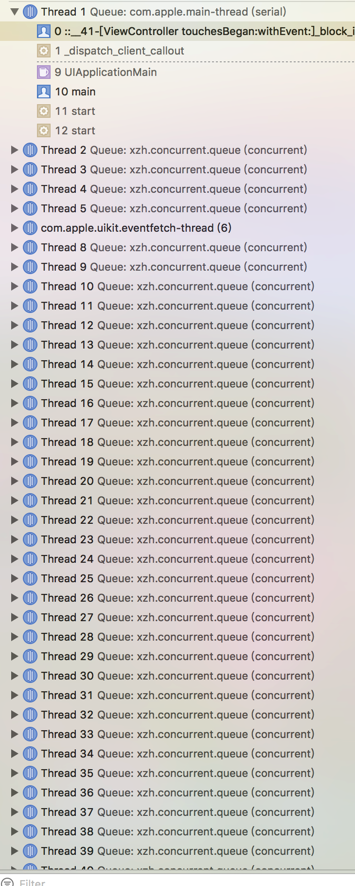

# XZHGCDDispatcher

[](https://travis-ci.org/xiongzenghui/ZHGCDDispatcher)
[](https://cocoapods.org/pods/ZHGCDDispatcher)
[](https://cocoapods.org/pods/ZHGCDDispatcher)
[](https://cocoapods.org/pods/ZHGCDDispatcher)

XZHGCDDispatcher basic on `YYDispatchQueuePool` component in `YYKit`.

## Example

To run the example project, clone the repo, and run `pod install` from the Example directory first.

## Requirements

This library requires `iOS 8.0+` and `Xcode 8.0+`.

## Installation

XZHGCDDispatcher is available through [CocoaPods](https://cocoapods.org). To install
it, simply add the following line to your Podfile:

```ruby
pod 'XZHGCDDispatcher'
```

## Usage

### use default global singleton pool instance enque block

```objective-c
for (int i = 0; i < 100; i++) {
    switch ((i%5)) {
        case 0: {
            XZHAsyncWithQOSUserInteractive(^{
                NSLog(@"task %d: %@", i, [NSThread currentThread]);
            });
        }
            break;
        case 1: {
            XZHAsyncWithQOSUserInitiated(^{
                NSLog(@"task %d: %@", i, [NSThread currentThread]);
            });
        }
            break;
        case 2: {
            XZHAsyncWithQOSUtility(^{
                NSLog(@"task %d: %@", i, [NSThread currentThread]);
            });
        }
            break;
        case 3: {
            XZHAsyncWithQOSBackgroud(^{
                NSLog(@"task %d: %@", i, [NSThread currentThread]);
            });
        }
            break;
        case 4: {
            XZHAsyncWithQOSDefault(^{
                NSLog(@"task %d: %@", i, [NSThread currentThread]);
            });
        }
            break;
    }
}
```

### use new pool instance enque block, and when not use set `pool instance = nil` to release pool

```objective-c
_pool = [[XZHDispatchQueuePool alloc] initWithName:@"test" queueCount:0];

for (int i = 0; i < 1000; i++)
  {
    XZHAsyncPoolWithQOSUserInteractive(_pool, ^{
      NSLog(@"%@", [NSThread currentThread]);
    });
    
    XZHAsyncPoolWithQOSUserInitiated(_pool, ^{
      NSLog(@"%@", [NSThread currentThread]);
    });
  }
  
_pool = nil;
```

## Concurrent queue may cause the number of threads to increase

### dispatch_get_global_queue()



### dispatch_queue_create(label, concurrent)


### conclusion

You should avoid using concurrent queues at will.

## Serial queue the same may caused

- 1、Dead loop creation serial queue
- 2、Frequent creation and destruction of heavyweight objects（AVPlayer、AVPlayerLayer ...）

## Controlling thread concurrency

- 1、Using pool mechanism to control the maximum concurrent number of threads
- 2、Because most of the CPU tasks in mobile terminal app do not consume much time.
- 3、so don't need too many threads
- 4、But because of too many threads, CPU switching and resource competition loss performance are caused.
- 5、Avoid frequent creation and destruction of threads, and control the number of concurrent threads, both to meet the number of concurrent CPU, and not because of too many threads lead to performance losses


## Author

xiongzenghui, 280320955@qq.com

## License

XZHGCDDispatcher is available under the MIT license. See the LICENSE file for more info.
